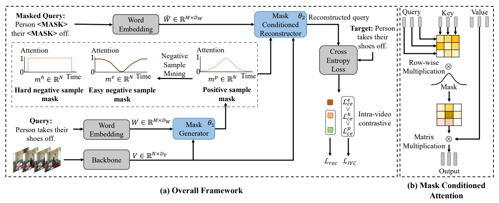

# CNM: Weakly Supervised Video Moment Localization with Contrastive Negative Sample Mining

In this work, we study the problem of video moment localization with natural language query and propose a novel weakly suervised solution by introducing Contrastive Negative sample Mining (CNM). 
Specifically, we use a learnable Gaussian mask to generate positive samples, highlighting the video frames most related to the query, and consider other frames of the video and the whole video as easy and hard negative samples respectively. We then train our network with the Intra-Video Contrastive loss to make our positive and negative samples more discriminative. 

Our paper was accepted by AAAI-2022. [[Paper](https://minghangz.github.io/uploads/CNM/CNM_paper.pdf)] [[Project Page](https://minghangz.github.io/publication/cnm/)]

## Pipeline



## Main Results

### ActivityNet Captions Dataset

| IoU=0.1 | IoU=0.3 | IoU=0.5 | mIoU  |                         url                          | feature |
| :-----: | :-----: | :-----: | :---: | :--------------------------------------------------: | :-----: |
|  78.13  |  55.68  |  33.33  | 37.14 | [model](/checkpoints/activitynet/clip/model-best.pt) |  CLIP   |
|  79.74  |  54.61  |  30.26  | 36.59 | [model](/checkpoints/activitynet/c3d/model-best.pt)  |   C3D   |

### Charades-STA Dataset

| IoU=0.3 | IoU=0.5 | IoU=0.7 | mIoU  |                       url                        | feature |
| :-----: | :-----: | :-----: | :---: | :----------------------------------------------: | :-----: |
|  60.04  |  35.15  |  14.95  | 38.11 | [model](/checkpoints/charades/i3d/model-best.pt) |   I3D   |

## Requiments
- pytorch
- h5py
- nltk
- fairseq

## Quick Start

### Data Preparation
Please download the visual features from [here](https://pan.baidu.com/s/1_JiOUG3FKkKXij-0kVfkuA?pwd=ryeh) and save it to the `data/` folder. We expect the directory structure to be the following:

```
data
├── activitynet
│   ├── clip_vit_32_features.hdf5
│   ├── glove.pkl
│   ├── train_data.json
│   ├── val_data.json
│   ├── test_data.json
├── charades
│   ├── i3d_features.hdf5
│   ├── glove.pkl
│   ├── train.json
│   ├── test.json
```

We extract the [CLIP](https://github.com/openai/CLIP) feature every 8 frames for ActivityNet Captions dataset. We use the I3D feature provided by [LGI](https://github.com/JonghwanMun/LGI4temporalgrounding) and use [this script](/data/convert_npy_to_hdf5.py) to convert the file format to HDF5. We also provide the results when training with the C3D feature, whose performance is slightly lower than the CLIP feature. If you would like to use the C3D feature, please download from [here](http://activity-net.org/challenges/2016/download.html) and save as `data/activitynet/c3d_features.hdf5`.

### Training

To train on the ActivityNet Captions dataset:
```bash
# With CLIP feature
python train.py --config-path config/activitynet/clip_feature.json --log_dir LOG_DIR --tag TAG
# With C3D feature
python train.py --config-path config/activitynet/c3d_feature.json --log_dir LOG_DIR --tag TAG
```

To train on the Charades-STA dataset:
```bash
python train.py --config-path config/charades/i3d_features.json --log_dir LOG_DIR --tag TAG
```

Use `--log_dir` to specify the directory where the logs are saved, and use `--tag` to identify each experiment. They are both optional.

The model weights are saved in `checkpoints/` by default and can be modified in the configuration file.

### Inference

Our trained model are provided in [`checkpoints/`](/checkpoints/). Run the following commands for evaluation:

```
python train.py --config-path CONFIG_FILE --resume CHECKPOINT_FILE --eval
```

The configuration file is the same as training.

## Acknowledege

We appreciate [SCN](https://github.com/ikuinen/semantic_completion_network) for its implementation with semantic completion network.
